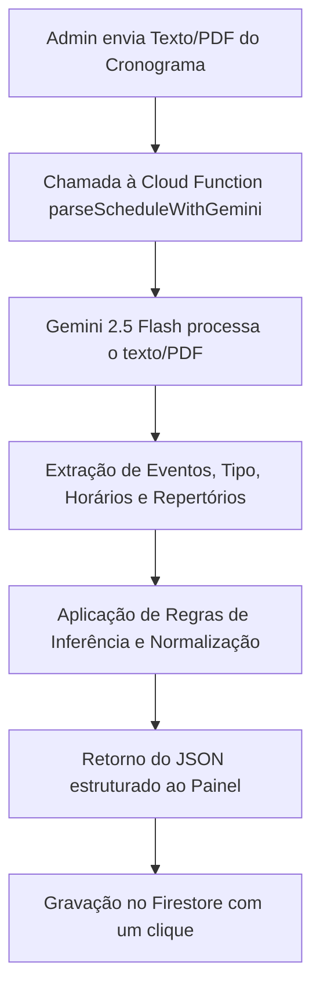
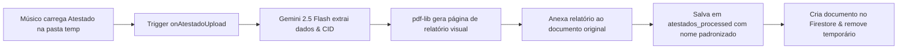

# Agenda Digital OER 🎵

> Um ecossistema moderno e robusto desenvolvido para a **Orquestra Experimental de Repertório (OER)**. Ele permite que músicos acompanhem atualizações de cronogramas, eventos e avisos em tempo real, contando com uma gestão simplificada e automatizada via painel administrativo de alta performance.

---

## 🌐 Endereços Oficiais

*   **Público (Músicos):** [oer-agenda.web.app](https://oer-agenda.web.app/)
*   **Gestão (Painel Admin):** [oer-agenda.web.app/admin.html](https://oer-agenda.web.app/admin.html)

---

## ✨ Funcionalidades Principais

### 📱 Para os Músicos (Site Público)
*   **Visualização Instantânea:** Acesso direto à Agenda de Ensaios e Temporada 2026 com carregamento otimizado.
*   **Performance & UX:** Uso de *Skeleton Screens* para carregamento visual suave e pré-carregamento preditivo em desktops.
*   **PWA (Progressive Web App):** Instale o site como um aplicativo no celular para acesso rápido e suporte básico a modo offline.
*   **Gestão de Cache Inteligente:** O sistema gerencia automaticamente o armazenamento local do celular do músico, limpando versões obsoletas de arquivos PDF para poupar memória.
*   **Acessibilidade & UI:** Botão de Feedback integrado ao rodapé e alternador de temas (Claro/Escuro/Sistema).
*   **Notificações Push:** Sistema de alertas imediatos para novos cronogramas, avisos urgentes ou atualizações, projetado para não obstruir o conteúdo principal em dispositivos móveis (suporta iOS e Android, controlável pelo admin).
*   **Letreiro Dinâmico (Ticker):** Exibição contínua de mensagens importantes no topo do site (ocultável pelo admin).
*   **Histórico de Avisos:** Central de comunicados passados com suporte a anexos de imagens e carregamento sob demanda (*lazy loading*).
*   **Pesquisa no Histórico:** Barra de busca dinâmica integrada ao histórico de avisos, permitindo pesquisar por palavras-chave nos títulos, mensagens, datas ou nos textos extraídos por OCR.

### 🔐 Para a Administração (Painel Admin)
*   **Dashboard Estatístico:** Monitoramento do número exato de músicos com notificações push ativas no navegador/celular.
*   **Gestão de Arquivos:** Upload simplificado de novos PDFs de cronograma com validação de tamanho e tipo.
*   **Envio e Agendamento de Avisos:** Disparo imediato ou agendamento para datas futuras de avisos contendo títulos, mensagens detalhadas, links adicionais e banners de imagens.
*   **Links Temporários:** Painel para adicionar, editar e remover botões de atalho rápidos (como formulários externos ou pesquisas) no topo do site público, com seletor de ícones dinâmico.
*   **Logs de Auditoria:** Histórico detalhado de todas as alterações feitas (envio de avisos, upload de PDFs, edição de links, otimizações do sistema) gravado em tempo real na coleção `adminLogs` para auditoria administrativa transparente.
*   **Controle Global de Notificações:** Toggle para desativar de forma global a exibição do letreiro de avisos (Ticker), o sino do histórico e o recebimento de notificações push no site público.
*   **Gerador de Ficha Técnica:** Área de botões no admin para compilar a Ficha Técnica da Orquestra utilizando IA ou gerador local, com opções de formato (Markdown, Rich Text/HTML para e-mail ou lista simples), escolha entre nome artístico/registro e cópia direta inteligente.
*   **Ambiente Sandbox:** Alternância rápida entre o modo Produção e Emuladores Locais diretamente pelo painel para desenvolvimento e homologação segura.

---

## 🤖 O Robô OER (Inteligência Artificial & Automações)

O **Robô OER** é o cérebro automatizado do sistema, integrando a API do **Google Gemini** para otimizar o fluxo de trabalho administrativo da orquestra:

### 1. Assistente de Escrita de Avisos
Ajuda o administrador a redigir títulos e mensagens para as notificações push. O robô consome dados contextuais do sistema (como os últimos logs administrativos e os próximos eventos do calendário) ou até mesmo imagens carregadas, criando uma notificação curta, envolvente e profissional. Utiliza referências e metáforas do universo musical (ex: *afinando*, *em compasso*, *nova partitura na estante*).

### 2. Leitor Inteligente de Cronogramas (`parseScheduleWithGemini`)
Permite carregar e-mails inteiros de avisos de ensaio ou arquivos PDFs brutos. O Robô OER analisa o texto e retorna um JSON estruturado e pronto para importação no Firestore, aplicando regras estritas de inferência de dados:
*   **Criação Separada:** Ensaios de naipes diferentes e ensaios tutti ocorrendo no mesmo dia são convertidos em eventos separados no banco de dados.
*   **Inferência de Locais Omitidos:** Ensaios gerais ou de naipes sem local especificado são mapeados automaticamente para `"Sala de Ensaios do TMSP (Subsolo)"`; concertos completos sem local são normalizados para `"Teatro Municipal de São Paulo (TMSP)"`.
*   **Inferência de Horários Padrão:** Concertos aos domingos no TMSP são programados por padrão para `"11:00"`; audições e reavaliações de músicos iniciam por padrão às `"13:00"`.
*   **Extração de Mapas:** Links do Google Maps são capturados de forma isolada, limpando o campo de texto do endereço para exibição otimizada na interface.



### 3. Extração e Análise de Atestados Médicos (`onAtestadoUpload`)
Fluxo totalmente automatizado de processamento para justificativas de faltas de músicos por meio do envio de atestados (imagem ou PDF):
*   **Extração com Gemini 2.5 Flash:** Captura automática do nome do músico (paciente), código CID (se disponível), data de início do afastamento, quantidade de dias e gera um resumo leigo e profissional sobre o diagnóstico para ajudar o RH.
*   **Geração de Relatório Premium:** Através da biblioteca `pdf-lib`, o robô cria uma nova página de relatório com design corporativo (tamanho 600x700px), contendo o logo da orquestra, tabela de informações extraídas, data de término calculada e o parecer da IA, anexando-o ao documento original.
*   **Armazenamento Seguro:** O PDF resultante é salvo com nomenclatura padronizada (`atestado_Nome_Data_Diasdias.pdf`) na pasta privada `atestados_processed/` no Firebase Storage e cadastrado na coleção `medicalCertificates` do Firestore com status `"pendente"`. Por segurança, o arquivo original da pasta temporária é excluído.



### 4. Auto-Cura de Assinaturas (`dailySubscriberCheck` & `checkSubscribersNow`)
Para evitar contadores estatísticos defasados decorrentes de expiração de tokens ou desinstalação do aplicativo:
*   **Rotina Diária:** Roda de forma programada às 6h da manhã. Ela executa uma contagem física dos tokens, compara com o contador consolidado e, se houver qualquer divergência, corrige-o no Firestore e registra uma auditoria de "Auto-Cura" nos logs.
*   **Varredura Manual:** O administrador pode clicar no card "Assinantes" (que agora funciona como botão de varredura) no painel admin. Isso dispara em tempo real a função `checkSubscribersNow`, que faz uma validação lógica de envio silencioso (`dryRun: true`) no FCM para cada token cadastrado no banco. Tokens rejeitados pelos servidores do Google/Apple são removidos instantaneamente em lote (*batch*), e o contador consolidado é recalibrado.

### 5. Geração Automatizada de Ficha Técnica (`generateFichaTecnica`)
Para gerar relatórios rápidos da composição da orquestra:
*   **Processamento Inteligente:** O Robô OER compila os músicos e monitores ativos no Firestore, envia os dados à Cloud Function e utiliza o Gemini 2.5 Flash para normalizar e estruturar uma Ficha Técnica linear completa dividida em cargos, regentes, naipes e ordem alfabética.
*   **Fallback de Segurança:** Caso a chamada de IA ou o cache no Firestore falhem, o sistema executa um parser local no Javascript para renderizar uma ficha com layout clássico da orquestra.

---

## 🛠️ Tecnologia e Arquitetura

O projeto utiliza o estado da arte em serviços serverless em nuvem:

*   **Frontend:** HTML5, Vanilla CSS3 (Design System Premium com CSS Variables, Glassmorphism e suporte nativo a temas), JavaScript (ES6+ Modular). Inclui lógica de **Analytics** local ([analytics.js](file:///Users/borisromaoantunes/Library/Mobile%20Documents/com~apple~CloudDocs/Developer/AI/Projeto%20-%20OER/assets/js/public/analytics.js)) para dados de uso de tela e engajamento.
*   **Banco de Dados:** **Firebase Firestore** para sincronização de dados e logs de auditoria em tempo real.
*   **Hospedagem:** **Firebase Hosting** com cache CDN e SSL automático.
*   **Armazenamento de Mídia:** **Firebase Storage** com pastas estruturadas para arquivos PDF (`pdfs/`), atestados temporários (`atestados_temp/`), atestados processados (`atestados_processed/`) e imagens de avisos.
*   **Backend Serverless:** **Cloud Functions (Node.js 22)** utilizando uma mistura otimizada de gatilhos V1 e V2.
*   **Notificações Push:** **Firebase Cloud Messaging (FCM)** para disparos multicast de alto volume.
*   **Service Worker Unificado:** Cache offline do PWA e recebimento de notificações push centralizados no mesmo Service Worker ([sw.js](file:///Users/borisromaoantunes/Library/Mobile%20Documents/com~apple~CloudDocs/Developer/AI/Projeto%20-%20OER/sw.js)) para maior confiabilidade.
*   **Segurança & Auditoria:** Regras do Firestore/Storage otimizadas com relatório de segurança em [auditoria_seguranca.md](file:///Users/borisromaoantunes/Library/Mobile%20Documents/com~apple~CloudDocs/Developer/AI/Projeto%20-%20OER/docs/auditoria_seguranca.md).
*   **Inteligência Artificial:** **Google Gemini API** (modelo `gemini-2.5-flash`) via SDK oficial `@google/genai` integrada ao backend.
*   **Manipulação de Arquivos:** **pdf-lib** para criar, compactar e alterar PDFs em ambiente serverless.
*   **Ícones:** **Lucide Icons** via CDN para manter a interface moderna e leve.

---

## 📁 Estrutura Técnica das Cloud Functions

As Cloud Functions estão centralizadas em `/functions/index.js` e dividem-se em:

| Função | Gatilho (Trigger) | Descrição |
| :--- | :--- | :--- |
| `sendPushNotification` | Firestore (`adminNotifications/{id}` - onDocumentCreated) | Dispara notificações push em lote para todos os tokens na coleção `fcmTokens`. Exclui tokens inválidos e registra o log. |
| `incrementSubscriberCount` | Firestore (`fcmTokens/{id}` - onDocumentCreated) | Incrementa de forma atômica o contador estatístico de inscritos. |
| `decrementSubscriberCount` | Firestore (`fcmTokens/{id}` - onDocumentDeleted) | Decrementa de forma atômica o contador estatístico de inscritos (com proteção de limite inferior a zero). |
| `dailySubscriberCheck` | Scheduler (Diário às 6:00 - 0 6 * * *) | Realiza a limpeza de tokens diária, corrige estatísticas no banco (Auto-Cura) e gera logs de tendência e atividade diária. |
| `suggestNotificationText` | HTTPS Callable (onCall) | Recebe diretrizes e dados contextuais (logs/calendário/imagem) e utiliza o Gemini 2.5 Flash para propor mensagens prontas. |
| `scheduledNotificationHandler`| Scheduler (A cada minuto - * * * * *) | Varre a coleção `scheduledNotifications` com status `pending` e executa o disparo das mensagens vencidas no minuto atual. |
| `scheduleNotification` | HTTPS Callable (onCall) | Cria e valida registros de notificações agendadas para data/hora futuras. |
| `onPDFUpload` | Storage (onFinalize em `pdfs/`) | Compacta e otimiza a estrutura de metadados de novos PDFs de ensaios utilizando `pdf-lib` para reduzir tempo de download dos músicos. |
| `onAtestadoUpload` | Storage (onFinalize em `atestados_temp/`)| Extrai dados médicos via Gemini 2.5 Flash, anexa página de relatório de IA premium, salva no banco e move o arquivo final, apagando o original. |
| `parseScheduleWithGemini` | HTTPS Callable (onCall) | Converte textos ou PDFs de cronograma em JSON de calendário estruturado com inferência e normalização baseada em IA. |
| `checkSubscribersNow` | HTTPS Callable (onCall) | Executa validação em tempo real de conectividade física (`dryRun`) dos tokens via FCM a pedido do administrador no painel. |
| `generateFichaTecnica` | HTTPS Callable (onCall) | Compila e formata a Ficha Técnica da Orquestra utilizando IA (Gemini 2.5 Flash), atualizando o cache no Firestore. |

---

## 🚀 Guia de Desenvolvimento e Manutenção

### 💻 Executando em Ambiente Local (Emuladores)

Para testar o ecossistema localmente sem consumir recursos de produção:

1.  **Instalar dependências**:
    No diretório raiz e na pasta `/functions`:
    ```bash
    npm install
    cd functions && npm install
    ```
2.  **Iniciar Emuladores do Firebase**:
    Inicie a suite completa de emuladores para rodar Firestore, Storage, Auth, Functions e Hosting locais:
    ```bash
    firebase emulators:start
    ```
3.  **Configurar credenciais administrativas localmente**:
    Use o script utilitário para definir privilégios de administração (Claims) a um usuário local do Firebase Auth:
    ```bash
    node scripts/set_admin_claim.js
    ```
    *(Nota: Configure o e-mail desejado na linha 9 de `set_admin_claim.js` antes de executar)*.

### 📦 Criando usuários para Teste e Produção
*   Para criar um usuário no ambiente de testes: `node functions/create_test_user.js`
*   Para criar um usuário no ambiente de produção: `node functions/create_prod_user.js`

### 🚀 Publicando para Produção (Deploy)

Para enviar alterações de frontend e backend ao Firebase:

*   **Deploy Completo (Front e Functions):**
    ```bash
    firebase deploy
    ```
*   **Deploy Apenas do Frontend (Hospedagem):**
    ```bash
    firebase deploy --only hosting
    ```
*   **Deploy Apenas das Cloud Functions:**
    ```bash
    firebase deploy --only functions
    ```

---

<p align="center">
  
  <br>
  <small>© 2026 Projeto OER. Desenvolvido por Boris Romão Antunes.</small>
</p>
